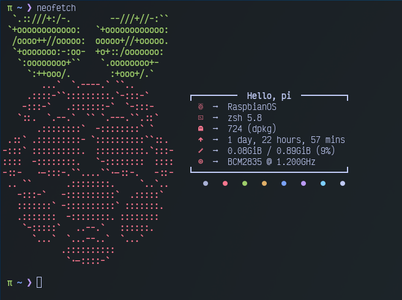

# rpi-neofetch

<kbd>

</kbd>

My simple neofetch setup for Raspberry Pi

### Installation
1. `git clone https://github.com/david531/rpi-neofetch.git`
2. Be SURE to backup your old neofetch config unless it's the default then...meh.
3. `cp rpi-neofetch/neofetch/* ~/.config/neofetch/`
4. Enjoy

### Zsh Theme
Theme I currently use: [Pi](https://github.com/tobyjamesthomas/pi)
